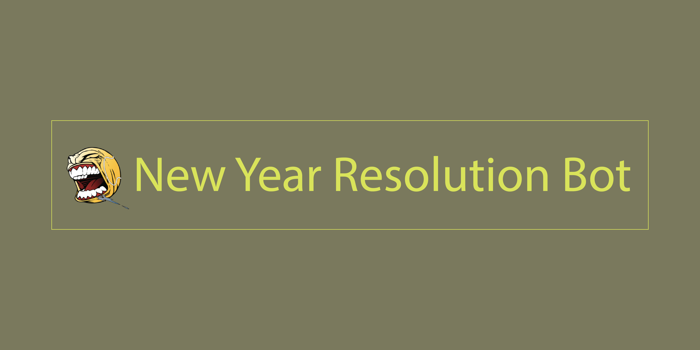
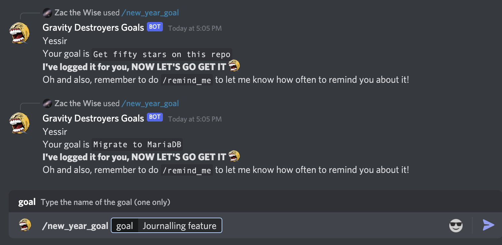
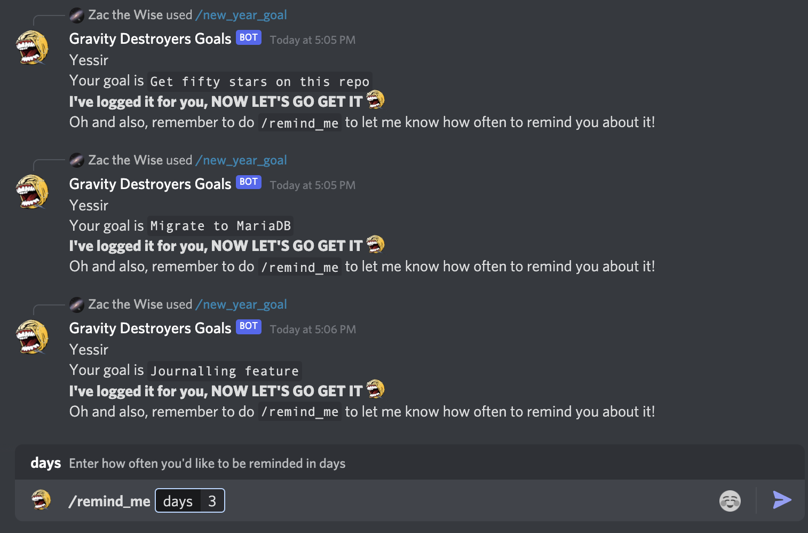
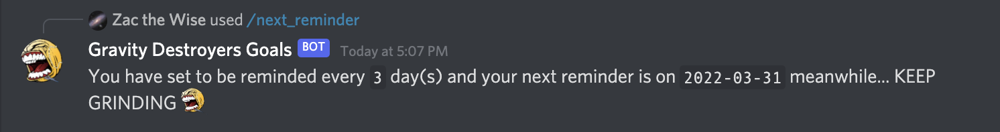
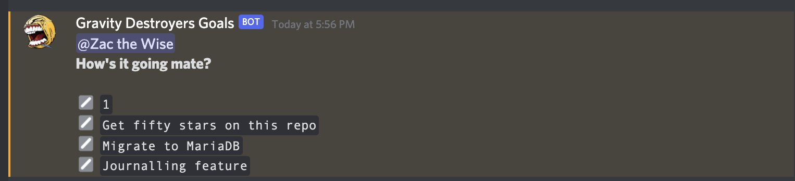

  
-----------

### Invite
  
Click the image for invite
### What
The New Years Resolution Bot is a discord bot created to motivate users to log their new year resolutions, remind them about these resolutions and provide accountability and motivation to help achieve those goals. 

### How

The New Years Resolution Bot is coded in [*Pycord*](https://github.com/Pycord-Development/pycord) and [*Python MySQL Connector*](https://dev.mysql.com/doc/connector-python/en/). The bot is coded to use entirely slash commands as a user interface for commands.

### Where

This bot was initially created for [one server](https://discord.gg/7Pjjf2XTFw) however we now have compatibility for **all** servers. Here's the [invite](https://discord.com/api/oauth2/authorize?client_id=922767657265168394&permissions=2147838976&scope=applications.commands%20bot).

## Commands

`/help`  
*Displays a information about the capabilities of the bot as well as a list of commands and their uses*

`/get_started`  
*Responds with a message explaining the basic commands to begin using the bot*  

`/config_reminder_channel`  
*Sets the server's reminder channel to enable reminding*

`/newyeargoal <goal>`  
*Logs a new goal*  

`/remindme <days>`  
*Instructs the bot how often to remind the user about their goals in days*  

`/view_goals`  
*Displays the users goals*  

`/view_ids`  
*Displays the users goals with their corresponding ID in the database. The ID is used for actions such as deleting a goal or marking it as achieved*  

`/goal_achieved <ID>`  
*Marks the goal with the specified ID as achieved*  

`/stop_reminding`  
*Instructs the bot to stop reminding the user of their goals* T_T  

`/change_reminder_interval <days>`  
*Changes how often the bot reminds the user*  
  
`/next_reminder`  
*Displays how often the user is being reminded and the date of their next reminder*

`/clear_goals` or   `/cleargoals <id>`  
*Deletes all goals and reminders or deletes a specific goal and preserves reminders.*

`/edit_goals <id> <new_goal>`  
*Edits a goal with the given id*

## Setup
### Environment Variables
 
Create a `.env` or set environment variables with the following values  
The discord bot's token `TOKEN`    
MySQL DB information: `MYSQLHOST` `MYSQLUSER` `MYSQLPASSWORD` `MYSQLDATABASE` `MYSQLPORT`    
### Tools

Useful tools and setup guides in [tools](./tools/)  

### DB Logic

`goal` *is used for storing each user's goals as well as their user id and name, in the future it will also store the server ID of which the command was invoked in.*  

`reminder` *stores the uername, user id and how often (in days) the user wishes to be reminded.*  

`next_reminder` *stores the username, user id and next date each user should be reminded on.*    
  
`config` *stores server ids and their preferred reminder channel id*

## Folder Organisation
[**`src`**](./src/)  
Contains all the bot's source code. Including [`main.py`](./src/main.py) and the [`cogs`](./src/cogs) folder  

[**`tools`**](./tools/)  
Contains database setup and migration programs.

[**`data`**](./data/)  
Contains media assets used in the repositories readme's

### Other files
[**`Dockerfile`**](./Dockerfile)  
Contains the [instructions](https://docs.docker.com/engine/reference/builder/) for the bot's image build.  

[**`backlogs.md`**](./backlogs.md)  
Contains future features to work on (though the list is may not be complete)  

## Hosting
The bot is hosted using [Docker](https://www.docker.com/) run on a  Network Attached Storage device. Tools on Docker and MYSQL database setup in [tools](./tools/) and a [guide here](./tools/DOCKERWORKFLOW.md).

While I no longer use RailwayApp, I still highly recommend it for free hosting.

## Examples
#### Logging a new goal
 
 
#### Setting a reminder
   
   
#### Viewing the reminder set

#### Example reminder

## License

The New Year Resolution Bot is licensed under the GPL 3.0 license. See the [`LICENSE`](./LICENSE) file for more information.

---
### 🎉 Commit labels
If you're interested in the commit labels used in this repo, check out my [git emoji](https://github.com/TechWiz-3/git-commit-emojis) project
